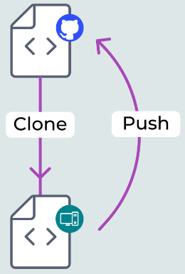
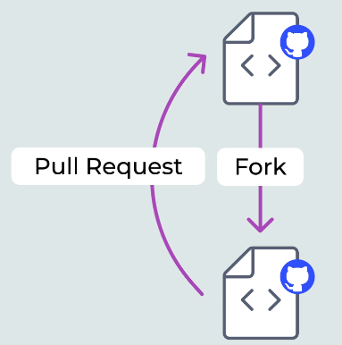
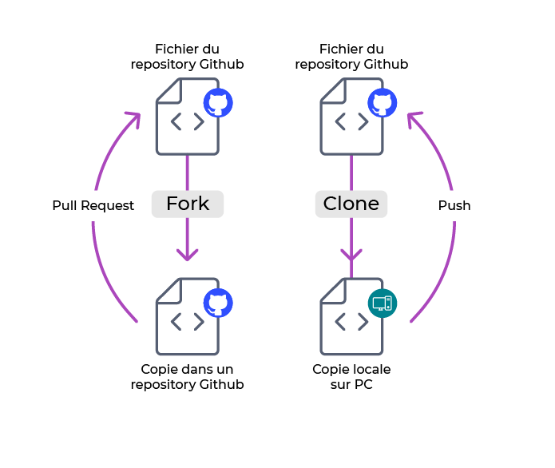
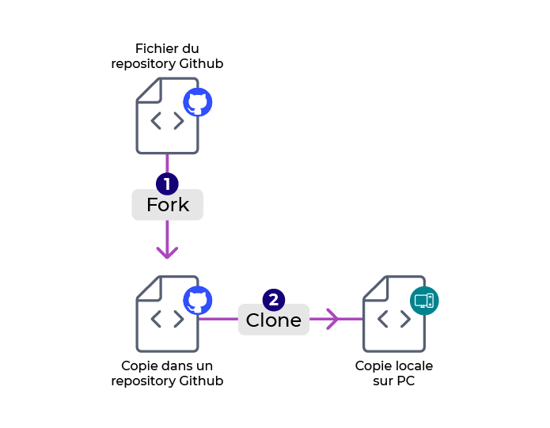
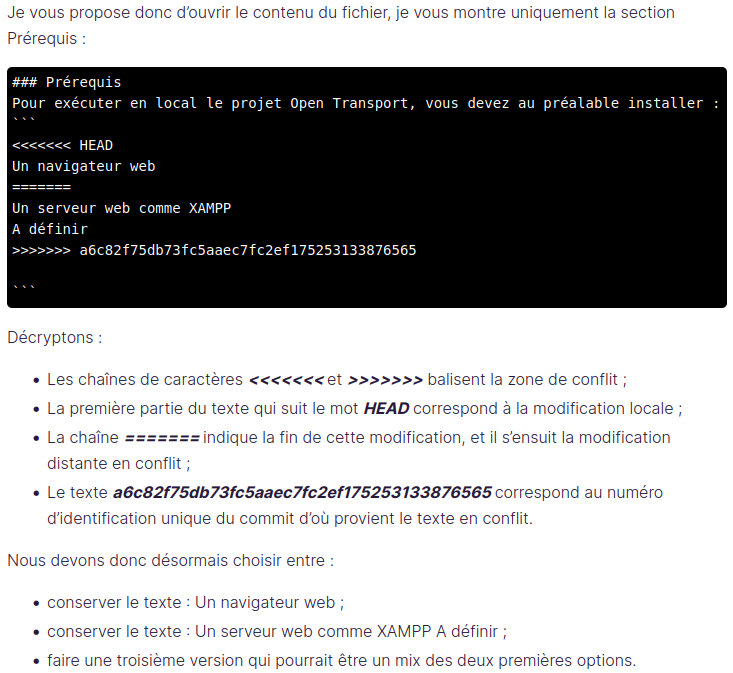
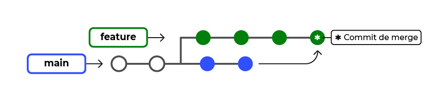
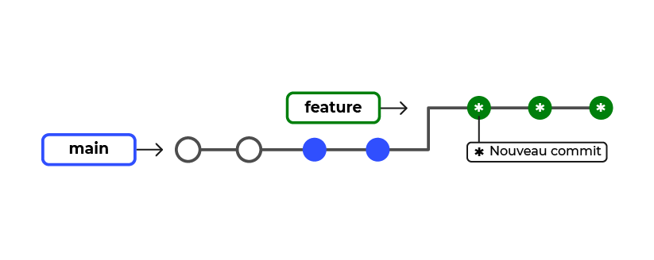
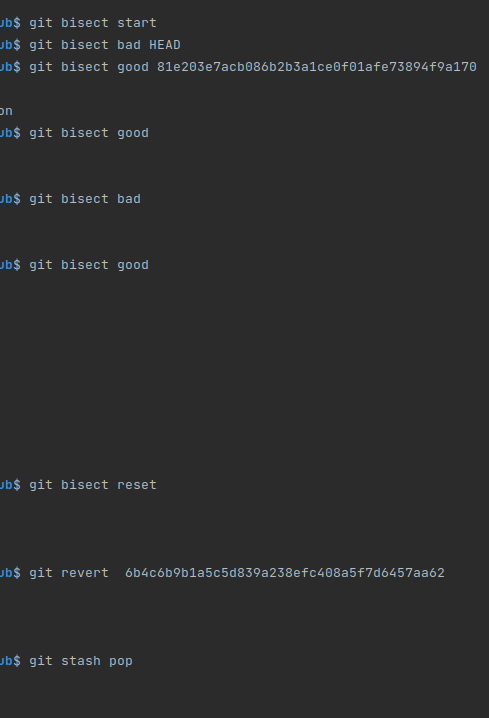
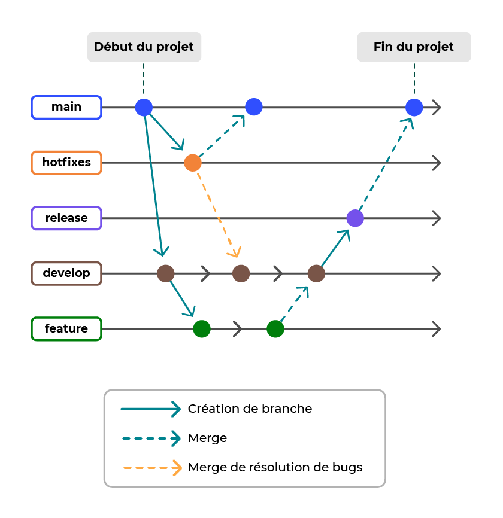
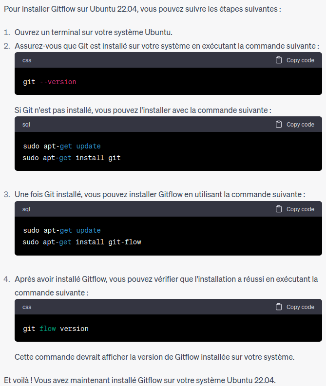

# Qu'est-ce qu’un gestionnaire de versions ?
  
    Un gestionnaire de versions est un programme qui permet aux développeurs de conserver un historique des modifications 
    et des versions de tous leurs fichiers.

Le gestionnaire de versions permet de garder en mémoire :

    chaque modification de chaque fichier ;

    pourquoi elle a eu lieu ;

    et par qui ! 

Si vous travaillez seul, vous pourrez garder l’historique de vos modifications ou revenir à une version précédente facilement.

Si vous travaillez en équipe, plus besoin de mener votre enquête ! Le gestionnaire de versions fusionne les modifications des 
personnes qui travaillent simultanément sur un même fichier. Grâce à ça, vous ne risquez plus de voir votre travail supprimé par
erreur !  

Cet outil a donc trois grandes fonctionnalités :

    Revenir à une version précédente de votre code en cas de problème.

    Suivre l’évolution de votre code étape par étape.

    Travailler à plusieurs sans risquer de supprimer les modifications des autres collaborateurs. 

Git et GitHub sont deux choses différentes.

    Git est un gestionnaire de versions. Vous l’utiliserez pour créer un dépôt local et gérer les versions de vos fichiers.

    GitHub est un service en ligne qui va héberger votre dépôt. Dans ce cas, on parle de dépôt distant puisqu’il n’est 
    pas stocké sur votre machine.
C’est un peu confus ? Pas de panique, prenons un exemple pour illustrer cela.

    Imaginez, vous participez à la préparation d’un parfum. Chez vous, vous créez la base du parfum en mélangeant différents 
    ingrédients. Puis vous envoyez cette base dans un entrepôt où il sera stocké. Cette base de parfum pourra être distribuée 
    telle quelle ou être modifiée en y ajoutant d’autres ingrédients.

    Eh bien, c'est la même chose pour Git et GitHub. Git est la préparation que vous avez réalisée chez vous, et GitHub est 
    l'entrepôt où elle peut être modifiée par les autres ou distribuée.

## En résumé

    Un gestionnaire de versions permet aux développeurs de conserver un historique des modifications et des versions de tous leurs fichiers.

    Git est un gestionnaire de versions tandis que GitHub est un service en ligne qui héberge les dépôts Git. On parle alors de dépôt distant.

# Saisissez l'utilité des dépôts distants sur GitHub

    Un dépôt est comme un dossier qui conserve un historique des versions et des modifications d’un projet. Il peut être local ou distant.

 ## Le dépôt local

Un dépôt local est un entrepôt virtuel de votre projet. Il vous permet d'enregistrer les versions de votre code et d'y accéder au besoin.
Pour illustrer cette idée, prenons l'image de la réalisation d'un gâteau. Pour faire un gâteau, vous allez réaliser les étapes suivantes :

    préparer la pâte du gâteau ;

    stocker cette pâte au réfrigérateur ;

    réaliser la crème et en garnir la pâte ;

    stocker le gâteau assemblé au réfrigérateur ;

    décorer votre gâteau ;

    remettre le gâteau au réfrigérateur.

Dans cet exemple, le réfrigérateur est comme un dépôt local : c'est l'endroit où vous stockez vos préparations au fur et à mesure.

## Le dépôt distant

Le dépôt distant est un peu différent. Il permet de stocker les différentes versions de votre code afin de garder un historique délocalisé,
c'est-à-dire un historique hébergé sur Internet ou sur un réseau. Vous pouvez avoir plusieurs dépôts distants avec des droits différents 
(lecture seule, écriture, etc.).

Ainsi, les dépôts sont utiles si :

    vous souhaitez conserver un historique de votre projet ;

    vous travaillez à plusieurs ;

    vous souhaitez collaborer à des projets open source ;

    vous devez retrouver par qui a été faite chaque modification ;

    vous voulez savoir pourquoi chaque modification a eu lieu.

GitHub

C'est mon préféré, mais chuttt !! GitHub est un outil de communication et de collaboration entre plusieurs développeurs 
(ou toute autre personne qui écrit du texte). C’est une interface web créée pour faciliter l’interaction avec Git.

L’avantage de GitHub, c’est que depuis quelques années, il est devenu le book/portfolio des développeurs ! Dans beaucoup 
de processus de recrutement, on vous demandera maintenant votre lien GitHub ! Si ça, c’est pas un argument de taille ! 
Il permet de mettre en avant la qualité de son code, et ainsi montrer ses capacités et sa plus-value lorsque l’on recherche 
un emploi. GitHub est considéré comme un véritable réseau social, et permet de contribuer à des projets open source.
Il fonctionne par abonnement, mais pas de panique, il y a un abonnement gratuit qui est déjà très bien.
GitLab

GitLab est la principale alternative à GitHub depuis le rachat de GitHub par Microsoft ! Les anti-Microsoft ont même lancé 
le hashtag #MovingToGitLab ! GitLab propose une version gratuite hebergée par ses soins ou sur vos propres serveurs. 
Il existe aussi des versions payantes avec plus d’options.
Bitbucket

Bitbucket est la version de Atlassian. Elle plaira aux habitués de la gestion de projet sous Atlassian. Bitbucket conviendra
aussi bien aux étudiants ou petites équipes qu’aux grands groupes. Une version gratuite est disponible.

Vous avez fait votre choix ? Nous étudierons dans ce cours la solution GitHub, qui est la plus plébiscitée par les développeurs.
En résumé

    Un dépôt est comme un dossier qui conserve un historique des versions et des modifications d’un projet. Il est essentiel pour travailler en équipe ou collaborer à un projet open source.

    Un dépôt local est l’endroit où l’on stocke, sur sa machine, une copie d’un projet, ses différentes versions et l’historique des modifications.

    Un dépôt distant est une version dématérialisée du dépôt local, que ce soit sur Internet ou sur un réseau. Il permet de centraliser le travail des développeurs dans un projet collectif.

    Il existe plusieurs services en ligne pour héberger un dépôt distant, GitHub étant l’un des plus populaires.

Les pull requests (ou demandes de pull), vous permettent d'informer les autres utilisateurs des modifications que vous 
avez appliquées à une branche d'un repository sur GitHub, et que vous voulez fusionner avec le code principal.

Pour vérifier que vos paramètres ont bien été pris en compte, et vérifier les autres paramètres, il suffit de passer la commande  
  
    git config --list

# Travaillez depuis votre dépôt local Git

## Appréhendez le fonctionnement de Git

## Le Working directory

    Cette zone correspond au dossier du projet sur votre ordinateur.

    Souvenez-vous, dans la partie précédente nous avons initialisé le dépôt “PremierProjet”. Eh bien ce dépôt, c’est la zone bleue du schéma.

## Le Stage ou index

    Cette zone est un intermédiaire entre le working directory et le repository. Elle représente tous les fichiers modifiés que vous souhaitez voir apparaître dans votre prochaine version de code.

## Le Repository

    Lorsque l’on crée de nouvelles versions d’un projet (vous vous souvenez, les 3 versions différentes du gâteau ?), c’est dans cette zone qu’elles sont stockées.

Ces 3 zones sont donc présentes dans votre ordinateur, en local.

## En-dessous, vous trouvez le repository GitHub,

    c’est-à-dire votre dépôt distant.

En résumé

    git add permet d’ajouter des fichiers dans l’index, qui est une zone intermédiaire dans laquelle stocker les fichiers modifiés.

    git commit permet de créer une nouvelle version avec les fichiers situés dans l’index.

    git commit -m permet de créer une nouvelle version et de préciser le message rattaché au commit.

    git push permet d’envoyer les modifications faites en local vers un dépôt distant. 

# Appréhendez le système de branches

En résumé

    Une branche est une “copie” d’un projet sur laquelle on opère des modifications de code.

    La branche main (ou anciennement master) est la branche principale d’un projet.

    git checkout permet de basculer d’une branche à une autre.

    git merge permet de fusionner deux branches.

# Travaillez avec un dépôt distant

    git remote add OC https://github.com/OpenClassrooms-Student-Center/7162856-G-rez-Git-et-GitHub.git
OC représente le nom court que vous utiliserez ensuite pour appeler votre dépôt. Appelez-le comme bon vous semble,
mais un nom court et simple est toujours plus facile.
Cette ligne ne permet pas de copier le dépôt, mais permet de dire au dépôt que l’on pointe vers le dépôt distant.
    
    "git pull origin main" devient "git pull OC main"

## Réalisez une pull request

Une pull request, ou demande de pull, en français, est une fonctionnalité de GitHub qui permet de demander aux propriétaires 
d’un repository l’autorisation de fusionner nos changements sur la branche principale ou toute autre branche sur laquelle 
on souhaite apporter nos modifications.

En résumé

    Sur GitHub, nous pouvons récupérer l'URL d'un dépôt distant.

    git clone permet de copier en local un dépôt distant.

    git remote add permet de lier un dépôt à un "nom court", pour une plus grande facilité d’utilisation.

    git pull permet de dupliquer un dépôt GitHub en local.

    Une Pull Request permet de demander à fusionner votre code sur la branche principale.
# Quiz

# Pratiquez et corrigez vos erreurs sur un dépôt local

Grâce à la ligne de commande 

      ls -la 

, vous pouvez faire apparaître les dossiers cachés.

## J’ai créé une branche que je n’aurais pas dû créer

Avant de créer une branche, vous devez créer votre branche principale.

Pour cela, il vous suffit d’ajouter un fichier et de le commiter.

Créez un fichier "PremierFichier.txt" dans votre répertoire Test :

    touch PremierFichier.txt

Ajoutez-le avec la commande :

    git add PremierFichier.txt
    git commit

------------------------------------------------------------------------------------------------------------------------------------------
vous pouvez modifier la configuration de Git pour utiliser Sublime Text.

Pour ce faire, suivez ces étapes :

    Ouvrez un terminal et entrez la commande suivante pour ouvrir le fichier de configuration global de Git :

    git config --global --edit

Dans le fichier de configuration, recherchez la section [core] et ajoutez la ligne suivante :

    editor = subl

    Cela définit Sublime Text comme l'éditeur par défaut de Git. 

Si vous voulez définir vim :
    
    editor = vim

ou

Si vous voulez définir nano, vim ou sublime text :

    git config --global core.editor "nano"
    git config --global core.editor "vim"
    git config --global core.editor "subl"

Enregistrez et fermez le fichier de configuration.

Désormais, lorsque vous utilisez des commandes Git qui nécessitent l'ouverture d'un éditeur (comme git commit), Sublime Text sera utilisé comme éditeur par défaut.

Pour l'outil de merge

     git config --global merge.tool subl 

----------------------------------------------------------------------------------------------------------------------------------------------------------------------

Pour vérifier que le message a bien été enregistré, vous pouvez utiliser la commande 

    git log 

pour afficher l'historique des commits, qui devrait inclure le dernier commit que vous venez de créer.

Pour supprimer une branche:

    git branch -d brancheAsupprimer

Renommer la branche master:

    git branch -M main

Si vous avez déjà fait des modifications dans la branche que vous souhaitez supprimer, vous pouvez la supprimer avec la commande :

    git branch -D brancheAsupprimer

    La suppression de cette branche entraînera la suppression de tous les fichiers
    et modifications que vous n'aurez pas commités sur cette branche.

Si vous avez modifié votre branche principale (main ou master) avant de créer votre branche et que vous n'avez pas fait 
le commit, ce n’est pas bien grave. Il vous suffit de faire une remise - ou un stash en anglais.

    La remise, ou stash, permet de mettre vos modifications de côté, les ranger, 
    le temps de créer votre nouvelle branche et d’appliquer cette remise sur la nouvelle branche.

    git stash
Après avoir créé et basculé sur la nouvelle branche créée, pour récupérer les modifications mises de coté avec git stash, on doit faire:

    Et finalement, vous pouvez appliquer le stash pour :

    - récupérer les modifications que vous avez rangées dans le stash

    - Appliquer ces modifications sur votre nouvelle branche:

    "git stash apply"
    Cette commande va appliquer le dernier stash qui a été fait.

Si pour une raison ou une autre, vous avez créé plusieurs stash, et que le dernier n'est pas celui que vous souhaitez
appliquer, pas de panique, il est possible d’en appliquer un autre..

En premier lieu, regardez la liste de vos stash avec la commande suivante :

    git stash list

Cette commande va vous retourner un "tableau" des stash avec des identifiants du style :
Il suffira alors d'appeler la commande    git stash  en indiquant l'identifiant.

    git stash apply stash@{0}

Maintenant, admettons que vous ayez réalisé vos modifications et qu'en plus, vous ayez fait le commit. Le cas est plus 
complexe, puisque vous avez enregistré vos modifications sur la branche principale, alors que vous ne deviez pas.

Pour réparer cette erreur, vous devez analyser vos derniers commits avec la fonction "git log", 
Vous allez alors récupérer l'identifiant du commit que l'on appelle couramment le hash.
Par défaut, "git log" va vous lister par ordre chronologique inversé tous vos commits réalisés :

    git log

Maintenant que vous disposez de votre identifiant, gardez-le bien de côté. Vérifiez que vous êtes sur
votre branche principale et réalisez la commande suivante :

    git reset --hard HEAD^
    
    Cette ligne de commande va supprimer de la branche principale votre dernier commit.
    Le HEAD^ indique que c'est bien le dernier commit que nous voulons supprimer. 
    L’historique sera changé, les fichiers seront supprimés.
    Il n'est pas nécessaire d'écrire l'identifiant en entier. Seuls les 8 premiers caractères
    sont nécessaires.

Ensuite, vous passez sur la branche que vous voulez ajouter les modifications puis vous faites :

    git reset --hard ca83a6df

Lorsque l'on travaille sur un projet avec Git, il est très important de marquer correctement les modifications
effectuées dans le message descriptif. Cependant, si vous faites une erreur dans l'un de vos messages de commit,
il est possible de changer le message après coup :

    git commit -m "ahaha"

Pour modifier le message :

    git commit --amend -m "ahaha + ahaha"

    Attention ! Cette commande va fonctionner pour le dernier commit réalisé ! 

L'exécution de cette commande, lorsqu'aucun élément n'est encore modifié, vous permet de modifier 
le message du commit précédent sans modifier son instantané.

Imaginez maintenant que vous ayez fait votre commit, mais que vous réalisiez que vous avez oublié un fichier.
Dans un premier temps, ajoutez votre fichier : 
    
    git add fichier.txt
Puis réalisez le : 

    git commit --amend --no-edit

Votre fichier a été ajouté à votre commit et grâce à la commande "--no-edit" que vous avez ajoutée,
vous n'avez pas modifié le message du commit.

Il existe trois modes de git reset que vous pouvez utiliser pour supprimer un commit:

- Soft reset: Cette option conserve les modifications apportées dans le commit que vous supprimez.
Pour effectuer un soft reset, utilisez la commande :

      git reset --soft <commit> en remplaçant <commit> par l'identifiant du commit que vous souhaitez supprimer.

- Mixed reset: Cette option supprime le commit ainsi que les modifications qu'il contient, 
mais conserve les modifications dans la zone de staging. Pour effectuer un mixed reset, utilisez la commande :
     
      git reset <commit> en remplaçant <commit> par l'identifiant du commit que vous souhaitez supprimer.

- Hard reset: Cette option supprime complètement le commit et toutes les modifications qu'il contenait,
y compris les modifications dans la zone de staging. Pour effectuer un hard reset, utilisez la commande :

      git reset --hard <commit> en remplaçant <commit> par l'identifiant du commit que vous souhaitez supprimer.

En résumé

    git branch -d permet de supprimer une branche.

    git status permet de voir l’état des fichiers.

    git stash enregistre les modifications non indexées pour une utilisation ultérieure. 

    git log affiche l'historique des commits réalisés sur la branche courante.

    git reset --hard HEAD^ permet de réinitialiser l'index et le répertoire de travail à l'état du dernier commit.

    git commit --amend permet de sélectionner le dernier commit pour y effectuer des modifications.

# Corrigez vos erreurs en local et à distance

La journée a été difficile et par mégarde vous avez pushé des fichiers erronés.

Le problème, c'est que cette erreur concerne aussi les personnes avec qui vous travaillez sur le projet.
Prévenir vos collaborateurs, bien sûr !! 

Il est possible d'annuler son commit public avec la commande git revert. L'opération revert annule un commit 
en créant un nouveau commit. C'est une méthode sûre pour annuler des changements, car elle ne risque pas de 
réécrire l'historique du commit.

    git revert HEAD^

Par conséquent, il vaut mieux utiliser "git revert" pour annuler des changements apportés à une branche publique, 
et "git reset" pour faire de même, mais sur une branche privée.

**git revert** annule les changements apportés par un ou plusieurs commits en créant un nouveau commit qui contient 
les modifications inverses. Cela signifie que les modifications précédentes sont conservées dans l'historique des 
commits, mais que les modifications indésirables sont supprimées.

**git reset HEAD** permet d'annuler des changements qui n'ont pas encore été commités. Il permet de retirer les fichiers
de la zone de préparation (staging area) et de les ramener dans la zone de travail (working directory), tout en conservant
les modifications précédentes dans l'historique des commits. Cela signifie que les modifications indésirables sont 
supprimées, mais que les modifications précédentes sont conservées.

Exemple de **git revert** :
        
    Utilisez la commande git log pour identifier le hash du commit que vous souhaitez
    annuler. Par exemple, le hash est "123abc".
    Utilisez la commande **git revert 123abc** pour créer un nouveau commit qui annule les 
    changements apportés par le commit "123abc". Ce nouveau commit contiendra les modifications inverses.
    Par exemple, si le commit "123abc" ajoutait une ligne à un fichier, le nouveau commit supprimera cette ligne.
    Vous pouvez alors pousser le nouveau commit vers votre référentiel Git pour annuler les modifications.

Exemple de **git reset HEAD** :
    
    Supposons que vous avez modifié deux fichiers dans votre zone de travail et que vous avez ajouté ces modifications 
    à la zone de préparation en utilisant git add. Cependant, vous souhaitez annuler les modifications apportées 
    à l'un des fichiers et les retirer de la zone de préparation.
    Utilisez la commande **git reset HEAD nom_du_fichier** pour retirer le fichier de la zone de préparation et le ramener
    dans la zone de travail. Les modifications précédentes sont conservées dans l'historique des commits.
    Vous pouvez alors effectuer les modifications souhaitées dans le fichier et l'ajouter de nouveau à la zone de
    préparation à l'aide de git add.

Toutefois, attention, **git revert** peut écraser vos fichiers dans votre répertoire de travail, il vous sera donc
demandé de commiter vos modifications ou de les remiser.

Si votre accès à distance ne fonctionne pas, cela peut être dû à un problème d’authentification de votre réseau.
Pour le résoudre, il vous faut créer une paire de **clés SSH**.

Une clé Secure Shell, ou clé SSH, permet d’assurer une connexion sécurisée entre votre réseau et un dépôt distant sécurisé. 
C'est très utile quand vous avez besoin de vous authentifier sur une machine tierce, car cela vous évite d’avoir 
à vous identifier systématiquement

Nous allons maintenant générer notre duo de clés SSH :

Dans Git Bash, exécutez la commande :

    ssh-keygen -t rsa -b 4096 -C "johndoe@example.com"

Vous pouvez soit appuyer sur Entrée, soit indiquer un nom de fichier. Un mot de passe vous est ensuite demandé.

Pour la trouver, il suffit d'aller à l'adresse : C:\Users\VotreNomD'Utilisateur\, et d'afficher les dossiers masqués.

Dans ce dossier, vous avez donc deux fichiers, votre clé publique et votre clé privée.

La clé id_rsa.txt est votre clé privée alors que la clé id_rsa.pub est votre clé publique. 
Ici nous allons utiliser votre clé publique seulement. Vous pouvez copier votre clé publique
en l'ouvrant dans un bloc-notes.

Maintenant que vous disposez de votre clé SSH, voyons comment l'ajouter pour GitHub !

Cliquez sur SSH and GPG keys :

Puis sur New SSH Key :

Choisissez un titre et collez votre clé SSH :

Vous devrez ensuite confirmer votre mot de passe. Votre clé SSH sera alors ajoutée à votre compte GitHub !

En résumé

    git revert HEAD^ permet d'annuler un commit en créant un nouveau commit.

    La commande ssh-keygen permet de générer un duo de clés SSH.

    Vous pouvez configurer une nouvelle clé SSH sur GitHub.

Imaginez que votre client vous demande une nouvelle fonctionnalité ; vous travaillez dessus toute la journée 
et le lendemain, finalement, il change d'avis. Catastrophe !

Vous avez perdu une journée à développer une fonctionnalité pour rien, mais en plus il faut que vous trouviez
le moyen de revenir en arrière ! Heureusement, notre ami Git arrive à notre rescousse avec la commande **git reset**

# Les trois types de réinitialisation de Git
--------------------------------------------

La commande **git reset** est un outil complexe et polyvalent pour annuler les changements.
Elle peut être appelée de trois façons différentes, qui correspondent aux arguments de ligne de commande : 

    --soft, --mixed et --hard.

Nous allons commencer par   reset --hard  .

Si vous voulez exécuter cette commande, vérifiez 5 fois avant de la lancer et soyez sûr de vous à 200 %.

Exécutez la commande :

    git reset notreCommitCible --hard

git reset notreCommitCible --hard et git reset --hard notreCommitCible sont équivalents.

Cette commande permet de revenir à n'importe quel commit, mais en oubliant absolument tout ce qu'il s'est passé après !
Quand je dis tout, c'est TOUT ! Que vous ayez fait des modifications après ou d'autres commits, tout sera effacé !
C'est pourquoi il est extrêmement important de revérifier plusieurs fois avant de la lancer, vous pourriez perdre 
toutes vos modifications si elle est mal faite.

Cette utilisation de **git reset** constitue une manière simple d'annuler des changements qui n'ont pas encore été 
partagés. Cette commande est incontournable lorsque vous commencez à travailler sur une fonctionnalité, que vous vous 
êtes trompé et que vous voulez recommencer de zéro. Le **git reset --mixed** va permettre de revenir juste après votre 
dernier commit ou le commit spécifié, sans supprimer vos modifications en cours. Il permet aussi, dans le cas de fichiers 
indexés mais pas encore commités, de désindexer les fichiers.

    git reset HEAD~
Si rien n'est spécifié après **git reset**, par défaut, il exécutera un :

    git reset --mixed HEAD~ 

Le **HEAD** est un pointeur, une référence sur votre position actuelle dans votre répertoire de travail Git. 

Nous avons enfin, **git reset --soft**. Cette commande permet de se placer sur un commit spécifique afin de voir 
le code à un instant donné, ou de créer une branche partant d'un ancien commit. Elle ne supprime aucun fichier,
aucun commit, et ne crée pas de HEAD détaché.

# Oups, j'ai des conflits !

Essayons cette super commande en faisant un premier commit que nous allons finalement ne plus vouloir. 
Une fois votre commit fait, écrivez la commande suivante :

    git revert HEAD

Une fois votre commit "annulé", vous pouvez enlever votre fichier et réaliser de nouveau votre commit.
En résumé

    git reset est une commande puissante. Elle peut être appliquée de 3 façons différentes (--soft; --mixed; --hard).

    La commande git merge produit un conflit si une même ligne a été modifiée plusieurs fois. Dans ce cas, il faut indiquer à Git quelle ligne conserver.

    git reset permet de revenir à l'état précédent sans créer un nouveau commit.

    git revert permet de revenir à l'état précédent en créant un nouveau commit.

L'objectif d'un gestionnaire de versions est d'enregistrer les changements apportés à votre code. Il vous permet de consulter l'historique de votre projet pour :

    savoir qui a contribué à quoi ;

    déterminer où des bugs ont été introduits ;

    annuler les changements problématiques.

Peut-être, mais disposer de cet historique est inutile si vous ne savez pas comment l'utiliser ! C'est là que la commande "git log" entre en scène !

    git log

Par défaut, "git log" énumère en ordre chronologique inversé les commits réalisés. Cela signifie que les commits 
les plus récents apparaissent en premier. Cette commande affiche chaque commit avec son identifiant SHA, l'auteur 
du commit, la date et le message du commit. 

    Le SHA ou Secure Hash Algorithm est un identifiant. C'est ce grand code incompréhensible
    qui nous permettra de revenir en arrière si besoin, à un commit exact.

Git dispose d'un outil encore plus puissant, poussant le journal de logs à l’extrême.

    git reflog

**git reflog** va loguer les commits ainsi que toutes les autres actions que vous avez pu faire en local : 
vos modifications de messages, vos merges, vos resets, enfin tout, quoi. Comme "git log", "git reflog"
affiche un identifiant SHA-1 pour chaque action. Il est donc très facile de revenir à une action donnée
grâce au SHA. Cette commande, c'est votre joker, elle assure votre survie en cas d'erreur. Pour revenir
à une action donnée, on prend les 8 premiers caractères de son SHA et on fait :

    git checkout e789e7c

Si vous découvrez un bug dans votre projet, vous allez avoir besoin d'identifier son origine et de savoir qui 
a modifié chaque ligne du code. C'est à ce moment que  git blame  entre en scène.

La commande **git blame** permet d’examiner le contenu d’un fichier ligne par ligne et de déterminer la date
à laquelle chaque ligne a été modifiée, et le nom de l’auteur des modifications.

    git blame monFichier.php

git blame  va afficher pour chaque ligne modifiée :

    son ID ;

    l'auteur ;

    l'horodatage ;

    le numéro de la ligne ;

    le contenu de la ligne.

Lorsque vous travaillez avec une équipe de développeurs sur un projet de moyenne à grande taille, 
la gestion des modifications entre plusieurs branches de Git peut devenir une tâche complexe. Parfois, 
vous ne voulez pas fusionner une branche entière dans une autre et vous n'avez besoin que de choisir un 
ou deux commits spécifiques. Ce processus s'appelle **cherry-pick** !

**git cherry-pick**  n'est pas une commande très appréciée dans la communauté des développeurs, 
car elle duplique des commits existants. Je vous conseille plutôt de réaliser un merge.

Admettons que vous travailliez sur une branche "Mes évolutions", et que vous ayez déjà réalisé plusieurs commits.
Votre collègue a besoin de l'une de ces évolutions pour la livrer au client, mais pas des autres. C'est dans 
ce cas bien précis que nous allons faire appel à    git cherry-pick  ! Cette commande va permettre de sélectionner
un ou plusieurs commits grâce à leur SHA (décidément ils sont partout) et de les migrer sur la branche principale,
sans pour autant fusionner toute la branche "Mes évolutions".

    git cherry-pick d356940 de966d4

Ici, nous prenons les deux commits ayant pour SHA d356940 et de966d4, et nous les ajoutons 
à la branche principale sans pour autant les enlever de votre branche actuelle. Nous les dupliquons !

En résumé

    git log affiche l'historique des commits réalisés sur la branche courante.

    git reflog est identique à git log. Cette commande affiche également toutes les actions réalisées en local.

    git checkout un_identifiant_SHA-1 permet de revenir à une action donnée.

    git blame permet de savoir qui a réalisé telle modification dans un fichier, à quelle date, ligne par ligne.

    git cherry-pick un_identifiant_SHA-1 un_autre_identifiant_SHA-1 permet de sélectionner un commit et de l'appliquer sur la branche actuelle.

# Devenez un expert de Git et GitHub

----------------------------------------

    Forker le projet – ce qui aura pour conséquence de dupliquer le projet en créant un nouveau repo dans votre compte GitHub.

    Cloner le nouveau repository créé dans votre compte GitHub – ce qui va créer une copie locale du fork sur votre ordinateur.

Les issues permettent d’identifier une tâche à réaliser sur le projet. Elles peuvent représenter de nouvelles
fonctionnalités, des corrections, des problèmes à résoudre, etc. Elles sont généralement hiérarchisées, par
exemple par type, par importance, par thématique, etc.

En résumé

    Avant de contribuer à un projet open source, prenez connaissance de ses directives de collaboration.

    Pour contribuer à un projet open source, vous devez le forker puis cloner le nouveau repository sur votre poste de travail.

    Identifiez votre périmètre d’action en consultant les issues du projet.

    Proposez des modifications au projet en réalisant des pull requests.

Récapitulons ensemble :

Premièrement, pour conserver la version distante, j’ai utilisé la commande : 
    
    git checkout --theirs README.md.

Deuxièmement, pour conserver la version locale, j’ai utilisé la commande : 

    git checkout --ours README.md.

Et enfin troisièmement, pour corriger le conflit manuellement, j’ai ouvert le fichier et modifié son contenu.
Cette modification implique d’enlever les lignes ajoutées automatiquement par Git, et de conserver le texte de mon choix.

Pour chacune des situations, j’ai ensuite eu besoin d'exécuter les commandes git add, git commit et git push.

En résumé

    Git crée un conflit lorsqu’il ne sait pas quelle version d’un fichier il doit conserver. Cela arrive quand 
    un fichier a été modifié au même endroit par 2 sources distinctes !

    git status permet de comprendre la nature du conflit : c’est votre point de départ pour le résoudre.

    À vous de choisir la solution qui vous convient le mieux pour résoudre votre conflit :

        conserver la version distante ;

        conserver la version locale ;

        faire une version adaptée à la circonstance

# Corrigez l’historique du projet au fil de vos développements

La mémoire du repository Git est nommée historique. Ce dernier contient la liste des commits réalisés.

Chaque commit regroupe un ensemble d'informations (comme la date, l’auteur, le message, etc.). 
Il conserve également l’ID du commit précédent. Grâce à cela, Git peut retracer la chaîne des commits 
et fournir l’historique.
Vous pouvez visualiser l’historique avec la commande **git log**.

## Faites une correction simple sur l’historique du projet
Commençons avec un cas simple : alors que vous venez de résoudre une issue et que vous avez fièrement 
commité le résultat de votre travail, vous vous rendez compte que vous avez oublié un fichier.

Comment feriez-vous pour corriger cela ?

Facile, git add du fichier manquant puis git commit !

Certes, votre solution vous permettra d’obtenir le résultat souhaité, mais elle aura une conséquence fâcheuse : 
votre historique contiendra 1 commit supplémentaire qui, fondamentalement, n’apporte rien. En d’autres termes : 
cette solution va polluer votre historique.

Et alors, quel est le problème ?

Imaginez cette situation à l’échelle de grands projets avec de nombreux collaborateurs :
l’historique deviendrait de plus en plus illisible, et nous perdrions l’avantage d’une traçabilité 
claire des opérations sur le projet.

Git nous offre une solution simple avec l’option --amend de la commande git commit pour éviter cette situation. Voilà comment vous en servir :

    modification de 2 fichiers : README.md et CONTRIBUTING.md ;

    git add README.md ;

    git commit -m “Mise à jour de README.md et CONTRIBUTING.md”.

Oups ! On réalise notre erreur, nous avons oublié le fichier CONTRIBUTING.md :

    git add CONTRIBUTING.md ;

    git commit --amend. 
La commande git commit --amend implique la mise à jour du message du commit. Si vous ne souhaitez pas le modifier,
ajoutez l’option --no-edit.

## Modifiez précisément l’historique du projet

En bon contributeur, vous ne travaillez pas sur la branche main, vous avez créé une branche nommée feature
(ou fonctionnalité, en français) pour modifier les fichiers. Vous avez prévu de merger feature sur main 
une fois votre contribution réalisée.

Mais voilà, un problème majeur a été détecté par votre équipe sur la branche main, et il est résolu dans la foulée par 
un collaborateur. Vous pensiez que votre branche avait comme point de départ le dernier commit de la branche main 
mais ce n’est plus le cas ! Qui plus est, il vous faut intégrer le correctif appliqué à la branche main à votre branche.

Comment feriez-vous ?

Hum… je me place sur ma branche, puis je fais un git merge main.

Intéressant, vous allez en effet intégrer le correctif à votre branche à travers un commit de merge. 
C’est pas mal, mais ça a l’inconvénient, encore une fois, de polluer la lisibilité de l’historique.

On ne peut rien vous cacher ! L’heureuse élue est : **git rebase**. Cette commande permet de réécrire l’historique 
de la branche que l’on rebase. Cela signifie que cette branche est déplacée à la pointe de la branche main, 
comme le montre l’image ci-dessous :

Retenons qu’une fois positionné sur la branche feature, il ne vous reste plus qu’à exécuter 

    git rebase main.

Veillez à respecter cette règle d’or lorsque vous utilisez la commande rebase :
Ne réalisez jamais un rebase d’une branche publique (c'est-à-dire, une branche utilisée par plusieurs personnes).

## Réécrire l’historique
https://git-scm.com/book/fr/v2/Utilitaires-Git-R%C3%A9%C3%A9crire-l%E2%80%99historique

## Localisez et corrigez un bug sans impacter la tâche courante
Le dernier scénario que nous traiterons dans ce chapitre est assez fréquent pour les développeurs. Vous êtes en plein
développement d’une nouvelle fonctionnalité quand tout à coup, on vous informe d’un bug à résoudre en haute priorité.
Ce bug doit être résolu sur la branche que vous utilisez.

Laissez-moi vous apprendre une façon propre de traiter cette situation.

Voici la méthode :

    Mettre de côté le développement en cours.

    Identifier le commit qui est à l’origine du bug.

    Annuler ce commit.

    Reprendre le développement qui a été mis de côté.

Récapitulons les commandes utilisées :

    git stash permet de mettre de côté le développement en cours ;

    git stash pop permet de récupérer ce qui a été stashé ;

    git bisect (et ses options start, good, bad, reset) sert à identifier
    un commit problématique en parcourant l’historique ;

    git revert permet de créer un nouveau commit qui contient l’inverse du commit
    concerné, ce qui revient à annuler l’effet de ce dernier.

# Démarches pour Localisez et corrigez un bug sans impacter la tâche courante

    git stash
    git status
    git bisect start
    git bisect bad HEAD (pour indiquer que le commit actuel contient le problème)
    git log (pour récuperer l'id d'un commit dont on est sur que c'est bon)
    git bisect good id
    git bisect good (après verification et que l'erreur ne vient pas de là)
    git bisect good (après verification et que l'erreur ne vient pas de là)
    git bisect bad (après verification et que l'erreur vient de là)
    git bisect good (après verification et que l'erreur ne vient pas de là)
    git bisect bad (après verification et que l'erreur vient de là)

A la fin on aura l'id du commit en erreur. On le copie puis:

    git bisect reset (pour sortir de bisect)
    git revert id
    git stash pop (pour revenir à ce qu'on faisait)
    

En résumé

    git commit --amend permet de modifier le dernier commit.

    git rebase permet de réécrire l’historique d’une branche.

    git stash permet de mettre de côté le développement en cours.

    git stash pop permet de récupérer le développement mis de côté.

    git bisect permet d’identifier un commit problématique en parcourant l’historique. 

    git revert permet d’annuler un commit.

# Découvrez les workflows

    Commençons par définir ce qu’est un workflow : il s’agit d'instructions ou de recommandations
    à suivre pour utiliser Git et GitHub de façon efficace. C’est, en quelque sorte, une ligne de 
    conduite pour tous les collaborateurs.
Deux options se présentent à eux : créer pour chaque projet son propre workflow, ou bien réutiliser
des workflows qui ont fait leurs preuves !

Laissez-moi vous présenter les cinq plus connus d’entre eux :

## Le workflow centralisé (Centralized Workflow)

    Le workflow centralisé est la méthode la plus simple pour utiliser Git. Son principe ? 
    Tous les collaborateurs utilisent la même branche.

    Ainsi, on crée d’abord un repository centralisé, qui est ensuite cloné par tous les collaborateurs.
    Puis, on alimente ce repository par une suite de git pull / git push. Les conflits sont gérés sur 
    la branche main utilisée par tous les collaborateurs.

## Le workflow de création de branches de fonctionnalités (Feature Branch Workflow)
    Son principe ? Pour chaque nouvelle fonctionnalité, une branche est créée. La branche main ne contient
    pas de fonctionnalités en cours de développement.

    Dans la pratique, on crée un dépôt centralisé, qui est ensuite cloné par tous les collaborateurs. Ensuite,
    pour chaque fonctionnalité, on crée une nouvelle branche. Lorsqu’une fonctionnalité est terminée, la branche 
    de fonctionnalité doit être mergée sur la branche main via une pull request.

## Le workflow basé sur le tronc (Trunk Based Development)
    En réponse à la montée en puissance des techniques d’intégration continue et de développement continu,
    ce workflow est de plus en plus utilisé.

    Son principe ? Les opérations de merge sur la branche principale (nommée Trunk) sont à haute fréquence,
    tout en permettant au trunk d’être toujours opérationnel. On s’inspire ici des principes agiles et de la 
    volonté d’itérer rapidement.

    Son principal atout est de résoudre certains inconvénients de GitFlow tels que les branches de fonctionnalités 
    qui s’éternisent dans le temps, ou la complexité qui en découle lors du merge.

## Le workflow GitFlow
    C’est une évolution du workflow de création de branches de fonctionnalités présentée par Vincent Driessen 
    en 2010 dans l’article (en anglais) “A successful Git branching model”. Son principe ? Définir encore plus
    précisément les rôles des branches et les interactions entre elles. Je ne vous en dis pas plus, nous découvrirons
    cet outil en détail dans la suite de ce chapitre.

## Le workflow de duplication (Forking Workflow)
    Ce workflow diffère des précédents dans la mesure où il peut être combiné avec ceux-ci.
    
    Son principe ? Le gestionnaire du projet crée un dépôt officiel du projet. Chaque collaborateur crée ensuite 
    un double (fork) côté serveur de ce dépôt officiel. Puis, il crée un dépôt local (clone) sur la base du fork.
    Pour contribuer au dépôt officiel, les collaborateurs utilisent des pull requests. C’est ensuite le gestionnaire 
    du projet qui validera ou non les contributions.
    En effet, le workflow de duplication est généralement utilisé dans les collaborations open source.

# GitFlow

GitFlow repose sur le workflow de création de branches de fonctionnalités. Ainsi, on dispose d’une branche par
fonctionnalité (de type feature). Mais il introduit également :

    une branche, nommée develop, qui sert à intégrer les branches de fonctionnalités ;

    des branches de livraison, de type release, qui vont regrouper un ensemble de fonctionnalités identifiées comme finalisées ;

    la branche main, qui contient uniquement du code provenant des branches de release ;

    des branches dédiées à la résolution des bugs, de type hotfix, pour traiter des bugs détectés dans la branche main.
GitFlow impose une procédure de travail contraignante. Ce qui est un vrai avantage dans les situations suivantes :

    vous êtes le gestionnaire d’un projet open source et vous souhaitez contrôler efficacement les contributions ;

    vous travaillez avec de nombreux développeurs juniors qui ont besoin d’être cadrés ;

    vous cherchez à limiter les risques de corruption sur le code d’un projet d’envergure.
D’un autre côté, cette procédure de travail contraignante peut devenir un réel inconvénient dans les situations
suivantes où vous travaillez :

    dans une startup qui a une volonté d’aller très vite dans le développement du produit ;

    avec des développeurs expérimentées ;

    dans un projet où l’agilité et les itérations rapides sont poussées à l'extrême.

# Utilisez les commandes GitFlow

En réalité, ces commandes sont des raccourcis vers les commandes de Git existantes.

# Voyons ensemble comment on utilise le workflow "gitFlow" et les commandes du plugin de ce dernier.
- Nous allons commencer par initialiser un nouveau repository git avec la commande:
   
      git flow init
- Plusieurs infos nous sont demandées. Concernant la première info, à savoir le nom de la branche pour 
la production au lieu de master, nous allons indiquer :
  
      main
- Pour le reste, nous allons laisser les valeurs par défaut, et donc nous faisons

      "entrer"

- À la fin le repository git est initialisé

- Executons la commande :

      git branch -v

      Nous constatons que deux branches ont été créées: 
      "main": qui contiendra le code de production.
      "develop": qui a pour objectif l'intégration des branches de fonctionnalité. et nous sommes sur "develop"

- Maintenant on va créer une nouvelle branche de fonctionnalité : 

      git flow feature start <nom_de_la_branche_de_fonctionnalité>
     
      nom_de_la_branche_de_fonctionnalité ici : fonctionnalite1

- Une nouvelle branche est créée, je suis automatiquement positionné sur cette branche.

- Je vais maintenant créer un nouveau fichier, puis le commiter pour simuler cette fonctionnalité

      echo "test" > test.txt 

      (ecrire test dans le fichier test.txt)

- On commit avec 

      git add test.txt
      git commit -m "ajout test.txt"

- Maintenant, je souhaite intégrer cette fonctionnalité dans la branche "develop"

      git flow feature finish fonctionnalite1

      la branche <nom_de_la_branche_de_fonctionnalité> va être mergée sur branche "develop" puis ensuite elle sera supprimée
      Nous avons maintenant notre fonctionnalité qui a été intégrée sur la branche "develop"

- Pour envoyer en production une fonctionnalité terminée, nous allons la releaser avec une nouvelle commande : 

      git flow release start 'version_de_la_release'
 
      Ici la version est '0.0.1'
      Grace à cette branche de release, nous pouvons faire d'ultime modification avant l'envoi en production.
      Mais ici il n y en a pas.

- Alors envoyons directement cette release en production avec :

      git flow release finish 'version_de_la_release'

      Ici la version est '0.0.1'
      Cette commande va déclencher plusieurs opérations qui vont nous demander de confirmer des messages par défaut 
      Ou bien de fournir un message pour un tag. pour le premier merge, nous laissons le message par défaut, 
      Pour ce tag, nous écrivons : tag 0.0.1
      Et enfin pour ce dernier merge, nous laissons le message par défaut.
      Voila la branche de release a belle et bien été intégrée à la branche "main".
- On peut vérifier cela avec la commande :

      git checkout main
      
- Puis constater le contenu de la branche avec la commande :

      ls -la

      Le fichier test.txt est bien présent

Récapitulons ce qui a été réalisé :

    1- Nous avons initialisé notre projet avec git flow init. Cela a eu pour conséquence non seulement de créer 
    la branche main comme nous en avions l’habitude, mais également la branche develop, et de nous positionner 
    sur cette dernière.

    2- Nous avons créé une nouvelle branche de fonctionnalité avec git flow feature start fonctionnalite1.
    La branche fonctionnalite1 a été créée à partir de develop.

    3- Nous avons réalisé un commit sur fonctionnalite1, puis exécuté git flow feature finish fonctionnalite1. 
    Ainsi la branche fonctionnalite1 a été merge sur develop.

    4- Enfin nous avons créé la release avec git flow release start 0.0.1, et nous l’avons immédiatement intégrée
    à la branche main avec git flow release finish ‘0.0.1’.

Je vous conseille de créer une pull request de votre travail entre les étapes 2 et 3, 
de manière à ce qu'il soit validé par qui de droit sur le repository distant ! 

