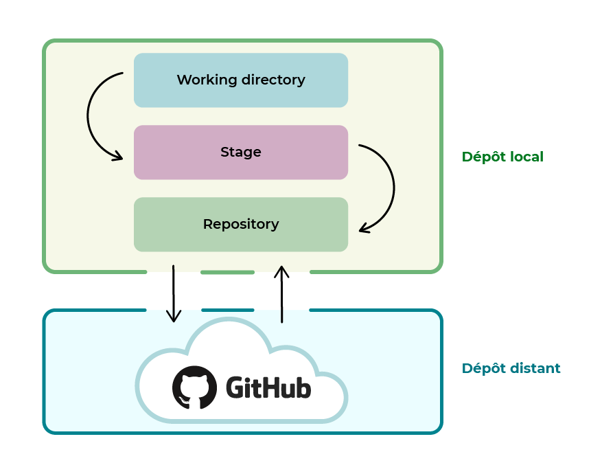

# Qu'est-ce qu’un gestionnaire de versions ?
  
    Un gestionnaire de versions est un programme qui permet aux développeurs de conserver un historique des modifications 
    et des versions de tous leurs fichiers.

Le gestionnaire de versions permet de garder en mémoire :

    chaque modification de chaque fichier ;

    pourquoi elle a eu lieu ;

    et par qui ! 

Si vous travaillez seul, vous pourrez garder l’historique de vos modifications ou revenir à une version précédente facilement.

Si vous travaillez en équipe, plus besoin de mener votre enquête ! Le gestionnaire de versions fusionne les modifications des 
personnes qui travaillent simultanément sur un même fichier. Grâce à ça, vous ne risquez plus de voir votre travail supprimé par
erreur !  

Cet outil a donc trois grandes fonctionnalités :

    Revenir à une version précédente de votre code en cas de problème.

    Suivre l’évolution de votre code étape par étape.

    Travailler à plusieurs sans risquer de supprimer les modifications des autres collaborateurs. 

Git et GitHub sont deux choses différentes.

    Git est un gestionnaire de versions. Vous l’utiliserez pour créer un dépôt local et gérer les versions de vos fichiers.

    GitHub est un service en ligne qui va héberger votre dépôt. Dans ce cas, on parle de dépôt distant puisqu’il n’est 
    pas stocké sur votre machine.
C’est un peu confus ? Pas de panique, prenons un exemple pour illustrer cela.

    Imaginez, vous participez à la préparation d’un parfum. Chez vous, vous créez la base du parfum en mélangeant différents 
    ingrédients. Puis vous envoyez cette base dans un entrepôt où il sera stocké. Cette base de parfum pourra être distribuée 
    telle quelle ou être modifiée en y ajoutant d’autres ingrédients.

    Eh bien, c'est la même chose pour Git et GitHub. Git est la préparation que vous avez réalisée chez vous, et GitHub est 
    l'entrepôt où elle peut être modifiée par les autres ou distribuée.

## En résumé

    Un gestionnaire de versions permet aux développeurs de conserver un historique des modifications et des versions de tous leurs fichiers.

    Git est un gestionnaire de versions tandis que GitHub est un service en ligne qui héberge les dépôts Git. On parle alors de dépôt distant.

# Saisissez l'utilité des dépôts distants sur GitHub

    Un dépôt est comme un dossier qui conserve un historique des versions et des modifications d’un projet. Il peut être local ou distant.

 ## Le dépôt local

Un dépôt local est un entrepôt virtuel de votre projet. Il vous permet d'enregistrer les versions de votre code et d'y accéder au besoin.
Pour illustrer cette idée, prenons l'image de la réalisation d'un gâteau. Pour faire un gâteau, vous allez réaliser les étapes suivantes :

    préparer la pâte du gâteau ;

    stocker cette pâte au réfrigérateur ;

    réaliser la crème et en garnir la pâte ;

    stocker le gâteau assemblé au réfrigérateur ;

    décorer votre gâteau ;

    remettre le gâteau au réfrigérateur.

Dans cet exemple, le réfrigérateur est comme un dépôt local : c'est l'endroit où vous stockez vos préparations au fur et à mesure.

## Le dépôt distant

Le dépôt distant est un peu différent. Il permet de stocker les différentes versions de votre code afin de garder un historique délocalisé,
c'est-à-dire un historique hébergé sur Internet ou sur un réseau. Vous pouvez avoir plusieurs dépôts distants avec des droits différents 
(lecture seule, écriture, etc.).

Ainsi, les dépôts sont utiles si :

    vous souhaitez conserver un historique de votre projet ;

    vous travaillez à plusieurs ;

    vous souhaitez collaborer à des projets open source ;

    vous devez retrouver par qui a été faite chaque modification ;

    vous voulez savoir pourquoi chaque modification a eu lieu.

GitHub

C'est mon préféré, mais chuttt !! GitHub est un outil de communication et de collaboration entre plusieurs développeurs 
(ou toute autre personne qui écrit du texte). C’est une interface web créée pour faciliter l’interaction avec Git.

L’avantage de GitHub, c’est que depuis quelques années, il est devenu le book/portfolio des développeurs ! Dans beaucoup 
de processus de recrutement, on vous demandera maintenant votre lien GitHub ! Si ça, c’est pas un argument de taille ! 
Il permet de mettre en avant la qualité de son code, et ainsi montrer ses capacités et sa plus-value lorsque l’on recherche 
un emploi. GitHub est considéré comme un véritable réseau social, et permet de contribuer à des projets open source.
Il fonctionne par abonnement, mais pas de panique, il y a un abonnement gratuit qui est déjà très bien.
GitLab

GitLab est la principale alternative à GitHub depuis le rachat de GitHub par Microsoft ! Les anti-Microsoft ont même lancé 
le hashtag #MovingToGitLab ! GitLab propose une version gratuite hebergée par ses soins ou sur vos propres serveurs. 
Il existe aussi des versions payantes avec plus d’options.
Bitbucket

Bitbucket est la version de Atlassian. Elle plaira aux habitués de la gestion de projet sous Atlassian. Bitbucket conviendra
aussi bien aux étudiants ou petites équipes qu’aux grands groupes. Une version gratuite est disponible.

Vous avez fait votre choix ? Nous étudierons dans ce cours la solution GitHub, qui est la plus plébiscitée par les développeurs.
En résumé

    Un dépôt est comme un dossier qui conserve un historique des versions et des modifications d’un projet. Il est essentiel pour travailler en équipe ou collaborer à un projet open source.

    Un dépôt local est l’endroit où l’on stocke, sur sa machine, une copie d’un projet, ses différentes versions et l’historique des modifications.

    Un dépôt distant est une version dématérialisée du dépôt local, que ce soit sur Internet ou sur un réseau. Il permet de centraliser le travail des développeurs dans un projet collectif.

    Il existe plusieurs services en ligne pour héberger un dépôt distant, GitHub étant l’un des plus populaires.

Les pull requests (ou demandes de pull), vous permettent d'informer les autres utilisateurs des modifications que vous 
avez appliquées à une branche d'un repository sur GitHub, et que vous voulez fusionner avec le code principal.

Pour vérifier que vos paramètres ont bien été pris en compte, et vérifier les autres paramètres, il suffit de passer la commande  
  
    git config --list

# Travaillez depuis votre dépôt local Git

## Appréhendez le fonctionnement de Git

## Le Working directory

    Cette zone correspond au dossier du projet sur votre ordinateur.

    Souvenez-vous, dans la partie précédente nous avons initialisé le dépôt “PremierProjet”. Eh bien ce dépôt, c’est la zone bleue du schéma.

## Le Stage ou index

    Cette zone est un intermédiaire entre le working directory et le repository. Elle représente tous les fichiers modifiés que vous souhaitez voir apparaître dans votre prochaine version de code.

## Le Repository

    Lorsque l’on crée de nouvelles versions d’un projet (vous vous souvenez, les 3 versions différentes du gâteau ?), c’est dans cette zone qu’elles sont stockées.

Ces 3 zones sont donc présentes dans votre ordinateur, en local.

## En-dessous, vous trouvez le repository GitHub,

    c’est-à-dire votre dépôt distant.

En résumé

    git add permet d’ajouter des fichiers dans l’index, qui est une zone intermédiaire dans laquelle stocker les fichiers modifiés.

    git commit permet de créer une nouvelle version avec les fichiers situés dans l’index.

    git commit -m permet de créer une nouvelle version et de préciser le message rattaché au commit.

    git push permet d’envoyer les modifications faites en local vers un dépôt distant. 

# Appréhendez le système de branches

